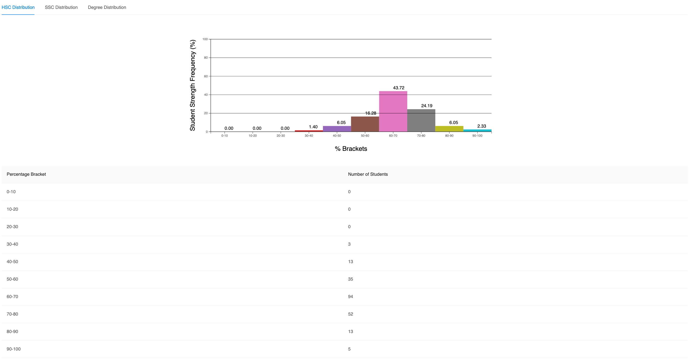
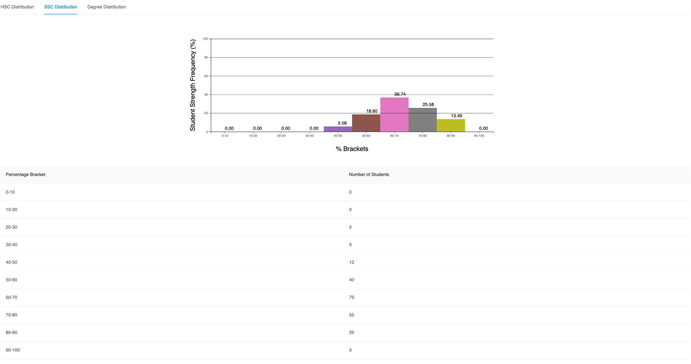
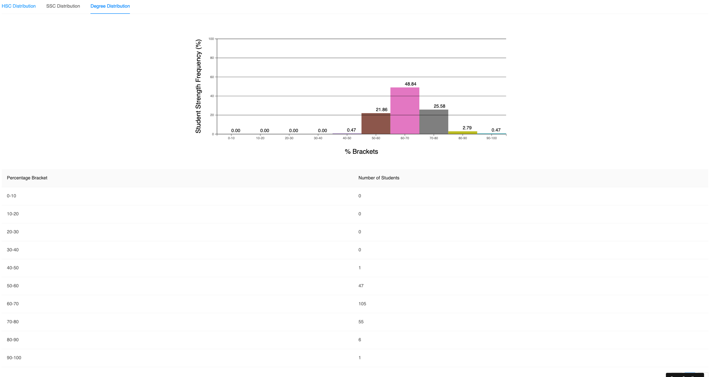
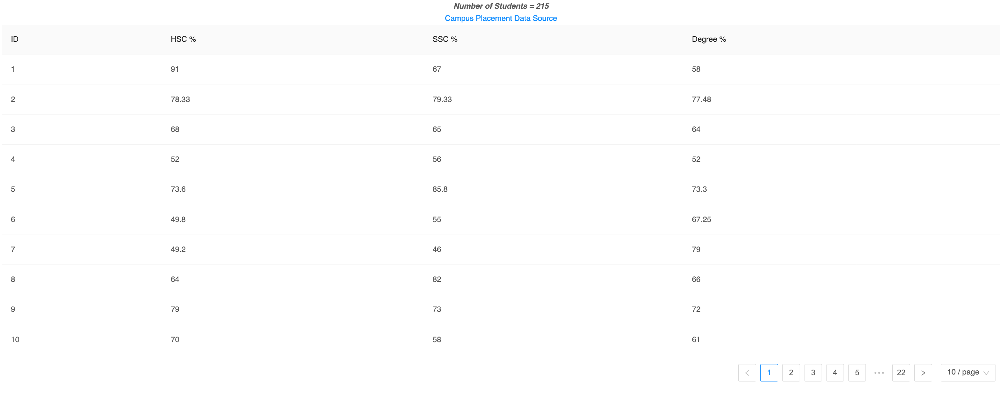

## Campus Data Visualization Tool

### Data Source
https://www.kaggle.com/benroshan/factors-affecting-campus-placement

### Get it started
Open the root folder in your terminal and execute this commands
```
npm i
npm start
```
and open http://localhost:3000 on your browser

* if nothing appears on screen, try reloading the page*

### Screenshots






### Code Sandbox Link
https://codesandbox.io/s/nameless-hill-hv5if

### App URL
Sandbox Preview URL: https://hv5if.csb.app/
HEROKU URL: 
NETLIFY URL: 